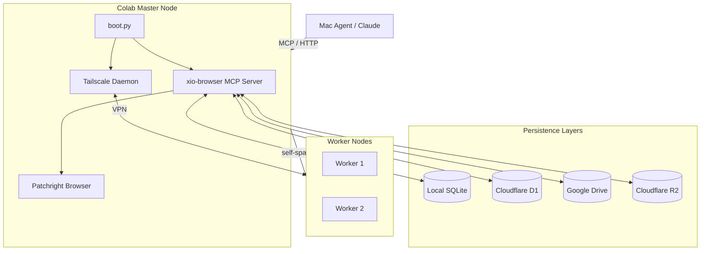
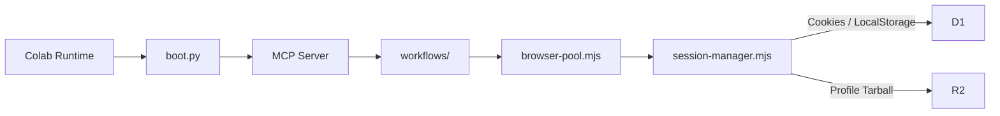

# XIO Mesh Architecture

This document outlines the high-level architecture, data flows, and lifecycle mechanisms of the XIO Browser/XIO Mesh system.

## High-Level System Architecture

## Data Flow Diagram

## Persistence Layers

The system uses a hybrid storage model to balance speed and reliability:

- **Local SQLite:** Fast, ephemeral storage for runtime data (jobs, job_steps, engine_stats, drive_assets).
- **Cloudflare D1 (Remote):** Primary cross-runtime store for all durable data, including `accounts`, `sessions`, `session_credentials`, `locks`, `node_registry`, `runtime_config`, and full JSON-based session state (`cookie_state`). Replaces the previous Supabase integration.
- **Cloudflare R2 (Object Store):** Primary storage for Chrome profiles (`.tar.gz`) and Tailscale state files.
- **Google Drive (Backup):** Cold backup for Tailscale states, jobs, workflows, session JSONs, and profiles.

## Mesh Network Topology

The mesh is built on Tailscale, allowing Colab runtimes to communicate securely regardless of their physical location or network constraints.

- **Master Node:** Auto-detected by `boot.py`. Operates as the central orchestrator and generates the primary `id_ed25519` SSH key pair.
- **Worker Nodes:** Dynamically provisioned runtimes. 
- **SSH Key Distribution:** The master uploads its public SSH key (`authorized_keys` format) to Google Drive. Worker nodes pull this key during startup, enabling secure SSH access for debugging and orchestration.

## Self-Spawn Lifecycle

The mesh can scale horizontally by auto-spawning new worker nodes via Colab:

1. **spawner.py / MCP:** A workflow triggers the self-spawn process.
2. **Account Selection:** The `selectSpawnAccount` function picks a valid account based on `tier` (`Pro`, `Starter`, `Any`) and `selection` strategy (`ordered`, `random`).
3. **self-spawn.mjs:** The workflow orchestrates the creation of a new Colab session.
4. **New Colab Runtime:** A fresh runtime boots, authenticates, and joins the Tailscale mesh.

## Session Lifecycle

A "session" represents a persistent browser identity slot.

1. **Account Registration:** A user account (e.g., Google email) is added to the `accounts` table.
2. **Session Creation:** A session slot is created (e.g., `PRFL-003_username`) mapping to the account.
3. **Browser Context:** The `browser-pool` creates an isolated context and loads state.
4. **Cookies/Profile:** `session-manager` injects cookies, localStorage, and IndexedDB data.
5. **Storage:** Upon completion or error, `session-manager` uses a `withSaveLock` mutex to safely persist state to Supabase (primary) and Drive (backup), and uploads the profile to R2.
