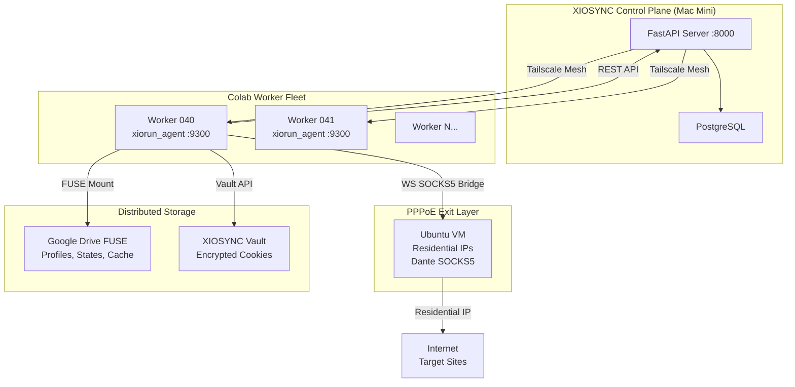
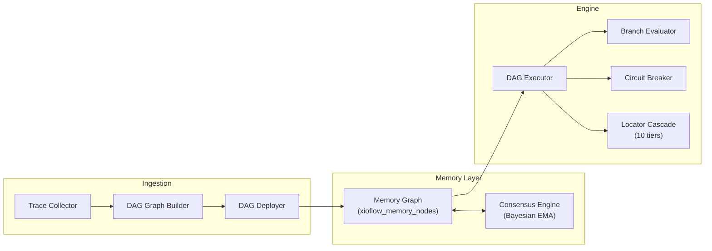
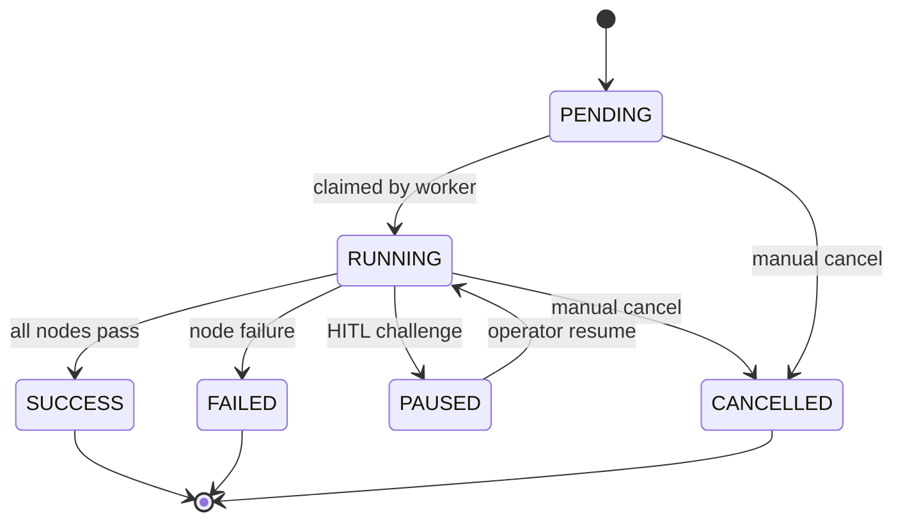
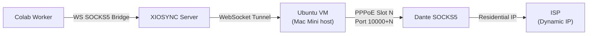
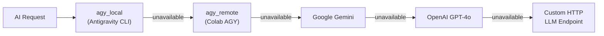

# XIOSYNC — Comprehensive Technical Documentation

> **Version:** Post-audit hardened | **Date:** 2026-10-06 | **Commit:** `7718478`
> **Codebase:** 94,025 lines of Python across 357 files | **Database:** 64 tables, 65 Alembic migrations

---

## Table of Contents

1. [System Architecture](#1-system-architecture)
2. [Control Plane — XIOSYNC Server](#2-control-plane)
3. [Subsystem: XIOFLOW — Workflow Orchestration](#3-xioflow)
4. [Subsystem: XIOGRID — Infrastructure & Proxy Mesh](#4-xiogrid)
5. [Subsystem: XIORUN — Browser Session Runtime](#5-xiorun)
6. [Subsystem: XIOVIEW — Live Observation](#6-xioview)
7. [Subsystem: XIOAI — AI Gateway](#7-xioai)
8. [Worker Runtime — Colab Agent](#8-worker-runtime)
9. [Platform Layer](#9-platform-layer)
10. [Persistence & Database Schema](#10-persistence)
11. [Security Architecture](#11-security)
12. [Browser Stealth Engine](#12-stealth-engine)

---

## 1. System Architecture



### Component Roles

| Component | Role | Location | Port |
|-----------|------|----------|------|
| **XIOSYNC Server** | Control plane API, DB, auth, orchestration | Mac Mini | `:8000` |
| **xiorun_agent** | Browser automation worker | Google Colab VMs | `:9300` |
| **PostgreSQL** | Primary data store (64 tables) | Mac Mini | `:5432` |
| **Tailscale** | Encrypted mesh VPN overlay | All nodes | WireGuard |
| **Google Drive FUSE** | Distributed profile/state storage | Workers | POSIX fs |
| **PPPoE Exit Nodes** | Residential IP proxy layer | Ubuntu VMs | SOCKS5 |
| **noVNC** | Real-time browser stream for HITL | Workers | `:6080` |

---

## 2. Control Plane

### [`xiosync/api/app.py`](file:///Users/karmareturns/projects/XIOSYNC/xiosync/api/app.py) — Application Root

The FastAPI application bootstraps through a strict 5-step startup sequence:

1. **Strict Config Loading** — [`load_config()`](file:///Users/karmareturns/projects/XIOSYNC/xiosync/platform/config.py) validates all `XIOSYNC_*` env vars, rejects unknown keys, enforces minimum 32-char auth secret, and validates PostgreSQL driver (`postgresql+psycopg://` only).
2. **Structured Logging** — [`configure_logging()`](file:///Users/karmareturns/projects/XIOSYNC/xiosync/platform/telemetry.py) installs JSON formatter with PII masking and OTel trace propagation.
3. **Database Engine** — [`create_database_engine()`](file:///Users/karmareturns/projects/XIOSYNC/xiosync/persistence/database.py) creates a pool of 5 connections (max overflow 10) with pre-ping validation.
4. **Migration Head-Gate** — [`verify_migrations_at_head()`](file:///Users/karmareturns/projects/XIOSYNC/xiosync/core/health.py) compares `alembic_version` against filesystem head. **Aborts startup if mismatched.**
5. **Service Composition** — Initializes `SessionService`, `IdentityRepository`, optional Redis rate limiter.

### Middleware Stack (8 Layers, Outermost → Innermost)

| # | Middleware | File | Purpose |
|---|-----------|------|---------|
| 1 | `StrictCORSMiddleware` | [`cors.py`](file:///Users/karmareturns/projects/XIOSYNC/xiosync/api/middleware/cors.py) | Validates explicit allowed origins; rejects `*` in production |
| 2 | `RequestIDMiddleware` | [`__init__.py`](file:///Users/karmareturns/projects/XIOSYNC/xiosync/api/middleware/__init__.py) | Generates/accepts UUIDv7 `X-Request-ID`, binds to contextvar |
| 3 | `SecurityHeadersMiddleware` | [`__init__.py`](file:///Users/karmareturns/projects/XIOSYNC/xiosync/api/middleware/__init__.py) | HSTS (2yr), X-Frame-Options DENY, CSP `default-src 'none'` (relaxed for XIOVIEW) |
| 4 | `BodySizeLimitMiddleware` | [`__init__.py`](file:///Users/karmareturns/projects/XIOSYNC/xiosync/api/middleware/__init__.py) | Rejects payloads > 1MB (RFC 7807 413) |
| 5 | `AuthenticationMiddleware` | [`__init__.py`](file:///Users/karmareturns/projects/XIOSYNC/xiosync/api/middleware/__init__.py) | Validates Bearer JWT → frozen `OrgContext`, sets PG RLS `SET LOCAL app.current_org` |
| 6 | `RateLimitMiddleware` | [`rate_limit.py`](file:///Users/karmareturns/projects/XIOSYNC/xiosync/api/middleware/rate_limit.py) | Redis sliding-window per org+IP. Bypasses `X-XIOSYNC-Internal` |
| 7 | `VersionGovernanceMiddleware` | [`versioning.py`](file:///Users/karmareturns/projects/XIOSYNC/xiosync/api/middleware/versioning.py) | Injects `X-API-Version: 1.0`, RFC 8594 Deprecation/Sunset headers |
| 8 | `ObservabilityMiddleware` | [`observability.py`](file:///Users/karmareturns/projects/XIOSYNC/xiosync/platform/observability.py) | Request count/duration metrics, Prometheus histograms, OTel spans |

### RBAC System — [`rbac.py`](file:///Users/karmareturns/projects/XIOSYNC/xiosync/api/middleware/rbac.py)

`require_capability(cap_name)` enforces that the calling actor holds the required capability group. Role hierarchy: `ORG_VIEWER (0) < ORG_MEMBER (1) < ORG_ADMIN (2) < ORG_OWNER (3)`. Platform admin overrides all. Raises `CapabilityDeniedError` (HTTP 403 RFC 7807).

### Unified Worker Auth — [`worker_auth.py`](file:///Users/karmareturns/projects/XIOSYNC/xiosync/api/middleware/worker_auth.py)

Dual-header authentication accepting both `X-XIOSYNC-Internal` (shared internal secret) and `X-Worker-Secret` (organization worker secret). Applied as a router-level dependency on all internal worker endpoints.

### Lifespan Events

**Startup:**
- Sets engine singleton via `set_engine()` for background task DB access
- Starts XIOVIEW background tasks (registry cleanup, audit log flusher)

**Shutdown:**
- Stops XIOVIEW background tasks
- Disposes database engine connection pool
- Closes Redis rate limiter

---

## 3. XIOFLOW — Workflow Orchestration

> **Path:** [`xiosync/subsystems/xioflow/`](file:///Users/karmareturns/projects/XIOSYNC/xiosync/subsystems/xioflow/)
> **Purpose:** DAG-based browser automation workflows with memory graph learning and consensus voting

### Architecture



### Core Components

| File | Component | Description |
|------|-----------|-------------|
| [`api/runs.py`](file:///Users/karmareturns/projects/XIOSYNC/xiosync/subsystems/xioflow/api/runs.py) | Run Dispatcher | Creates `xioflow_runs` + `xioflow_tasks`, captures `template_snapshot` JSONB at dispatch for immutable versioning. Supports HITL pause/resume/cancel. |
| [`api/events.py`](file:///Users/karmareturns/projects/XIOSYNC/xiosync/subsystems/xioflow/api/events.py) | Internal Worker API | Pending-DAG claim, completion reporting, HITL status, identity resolution, memory graph retrieval with BFS traversal and dangling intent warnings. `project_id` filtering on all queries. |
| [`api/dag.py`](file:///Users/karmareturns/projects/XIOSYNC/xiosync/subsystems/xioflow/api/dag.py) | DAG Deployment | Declarative graph deployment into memory nodes. Gemini-powered script-to-DAG conversion. |
| [`api/memory.py`](file:///Users/karmareturns/projects/XIOSYNC/xiosync/subsystems/xioflow/api/memory.py) | Memory API | Node ingestion, edge graph queries, action voting via `ConsensusEngine`. |
| [`api/templates.py`](file:///Users/karmareturns/projects/XIOSYNC/xiosync/subsystems/xioflow/api/templates.py) | Template CRUD | Workflow template management with slug-based lookup. |
| [`api/triggers.py`](file:///Users/karmareturns/projects/XIOSYNC/xiosync/subsystems/xioflow/api/triggers.py) | Triggers | Cron schedules and event-driven automation. |
| [`api/workflows.py`](file:///Users/karmareturns/projects/XIOSYNC/xiosync/subsystems/xioflow/api/workflows.py) | AI Workflow Gen | `WorkflowGenerator` creates workflows from natural language prompts. |
| [`engine/dag_executor.py`](file:///Users/karmareturns/projects/XIOSYNC/xiosync/subsystems/xioflow/engine/dag_executor.py) | DAG Executor | Core recursive graph walker. Sequential/concurrent node execution with auto-trace. |
| [`engine/branch_evaluator.py`](file:///Users/karmareturns/projects/XIOSYNC/xiosync/subsystems/xioflow/engine/branch_evaluator.py) | Branch Evaluator | Evaluates conditional branches and weighted edges. |
| [`engine/circuit_breaker.py`](file:///Users/karmareturns/projects/XIOSYNC/xiosync/subsystems/xioflow/engine/circuit_breaker.py) | Circuit Breaker | Protects unstable domains (threshold: 3 failures, 60s open window). |
| [`engine/locator_cascade.py`](file:///Users/karmareturns/projects/XIOSYNC/xiosync/subsystems/xioflow/engine/locator_cascade.py) | Locator Cascade | 10-tier Playwright locator fallbacks: role → test-id → text → css → xpath → coordinate. |
| [`engine/context_hash_router.py`](file:///Users/karmareturns/projects/XIOSYNC/xiosync/subsystems/xioflow/engine/context_hash_router.py) | Context Router | 5-tier context matching (viewport, OS, browser). |
| [`memory/memory_graph.py`](file:///Users/karmareturns/projects/XIOSYNC/xiosync/subsystems/xioflow/memory/memory_graph.py) | Memory Graph | Persistent `XioflowMemoryNode` storage — each node stores domain, intent, action_type, locators (6 tiers), and next_intents graph edges. |
| [`memory/consensus_engine.py`](file:///Users/karmareturns/projects/XIOSYNC/xiosync/subsystems/xioflow/memory/consensus_engine.py) | Consensus Engine | Bayesian EMA voting promotes nodes: `project_experimental → project_ground_truth → organization_shared`. |
| [`ingestion/trace_collector.py`](file:///Users/karmareturns/projects/XIOSYNC/xiosync/subsystems/xioflow/ingestion/trace_collector.py) | Trace Collector | Records human/script execution steps for learning. |
| [`ingestion/dag_graph_builder.py`](file:///Users/karmareturns/projects/XIOSYNC/xiosync/subsystems/xioflow/ingestion/dag_graph_builder.py) | Graph Builder | Transforms traces into declarative DAG specs. |
| [`ingestion/dag_deployer.py`](file:///Users/karmareturns/projects/XIOSYNC/xiosync/subsystems/xioflow/ingestion/dag_deployer.py) | DAG Deployer | Writes graph into persistent memory nodes. |

### State Machine

Workflow runs follow a strict state machine enforced by PostgreSQL trigger `trg_xioflow_runs_state_guard`:



> [!IMPORTANT]
> Terminal states (`SUCCESS`, `FAILED`, `CANCELLED`) are **immutable** — the PostgreSQL trigger blocks any UPDATE that would transition from a terminal state back to a non-terminal one.

### Dead Letter Queue

Failed tasks are automatically inserted into `xioflow_dead_letters` by trigger `trg_xioflow_tasks_dlq` when `retry_count >= max_retries` and state = `FAILED`.

---

## 4. XIOGRID — Infrastructure & Proxy Mesh

> **Path:** [`xiosync/subsystems/xiogrid/`](file:///Users/karmareturns/projects/XIOSYNC/xiosync/subsystems/xiogrid/)
> **Purpose:** Compute node management, residential PPPoE proxy pools, fingerprint profiles, and mesh networking

### PPPoE Exit Node Architecture



### Components

| File | Component | Description |
|------|-----------|-------------|
| [`models/exit_node.py`](file:///Users/karmareturns/projects/XIOSYNC/xiosync/subsystems/xiogrid/models/exit_node.py) | Data Models | `PPPoEHost` (Ubuntu VM SSH bridge), `FingerprintProfile` (hardware fingerprints), `PPPoEExitNode` (slots 0–980 per host with per-slot SOCKS5 on ports 10000+N) |
| [`models/browser.py`](file:///Users/karmareturns/projects/XIOSYNC/xiosync/subsystems/xiogrid/models/browser.py) | Browser Models | `BrowserPool`, `BrowserSession`, `ComputeRuntime`, `RuntimeNode`, `MeshNetwork`, `MeshNode` |
| [`services/pppoe_hosts.py`](file:///Users/karmareturns/projects/XIOSYNC/xiosync/subsystems/xiogrid/services/pppoe_hosts.py) | Host Manager | SSH bridge registration, health management, Tailscale IP tracking |
| [`services/pppoe_nodes.py`](file:///Users/karmareturns/projects/XIOSYNC/xiosync/subsystems/xiogrid/services/pppoe_nodes.py) | Slot Manager | Slot provisioning, IP assignment, per-account IP pinning, proxy lifecycle |
| [`services/script_runner.py`](file:///Users/karmareturns/projects/XIOSYNC/xiosync/subsystems/xiogrid/services/script_runner.py) | Script Runner | Executes `.mjs` Node.js automation scripts with timeout and proxy routing |
| [`pac_generator.py`](file:///Users/karmareturns/projects/XIOSYNC/xiosync/subsystems/xiogrid/pac_generator.py) | PAC Generator | Generates Proxy Auto-Config scripts for selective domain routing |

### PPPoE API Endpoints

| Method | Path | Purpose |
|--------|------|---------|
| `POST` | `/pppoe/hosts` | Register Mac Mini + Ubuntu VM host |
| `GET` | `/pppoe/hosts` | List registered hosts |
| `POST` | `/pppoe/slots/provision` | Provision single PPPoE slot |
| `POST` | `/pppoe/slots/provision-batch` | Batch provision slots |
| `POST` | `/pppoe/slots/acquire` | Acquire slot (with optional IP pinning) |
| `POST` | `/pppoe/slots/release` | Release assigned slot |
| `POST` | `/pppoe/slots/cycle` | Disconnect/reconnect for fresh residential IP |
| `POST` | `/pppoe/slots/start-proxies` | Start Dante SOCKS5 proxy on slots |
| `POST` | `/pppoe/slots/stop-proxies` | Stop SOCKS5 proxies |
| `GET` | `/pppoe/fingerprints` | List fingerprint profiles |

### Fingerprint Profiles

9 registered fingerprint profiles (`PRFL-001` through `PRFL-044`), each containing:
- **WebGL:** Vendor + renderer strings (e.g., `Google Inc. (Intel)` / `ANGLE (Intel, Mesa Intel UHD Graphics 630)`)
- **Canvas:** Seeded deterministic noise salt for canvas fingerprint perturbation
- **Audio:** Oscillator frequency noise parameters
- **Platform:** UA string, screen resolution, timezone, hardware concurrency, device memory, language
- **Network:** Connection type, RTT, downlink speed

---

## 5. XIORUN — Browser Session Runtime

> **Path:** [`xiosync/subsystems/xiorun/`](file:///Users/karmareturns/projects/XIOSYNC/xiosync/subsystems/xiorun/)
> **Purpose:** Remote Patchright/Chromium session provisioning over Tailscale mesh

### Components

| File | Component | Description |
|------|-----------|-------------|
| [`runtime_pool.py`](file:///Users/karmareturns/projects/XIOSYNC/xiosync/subsystems/xiorun/runtime_pool.py) | Runtime Pool | In-process singleton managing live Playwright pages, active run registrations, and launchers |
| [`launcher.py`](file:///Users/karmareturns/projects/XIOSYNC/xiosync/subsystems/xiorun/launcher.py) | Browser Launcher | 11-step launch lifecycle: concurrency check → fingerprint resolve → Drive profile download → Colab CDP command → fingerprint injection → exit-node guard → session state update |
| [`session_state.py`](file:///Users/karmareturns/projects/XIOSYNC/xiosync/subsystems/xiorun/session_state.py) | Session State | Cookie vault integration with SID-TTL validation |
| [`health_loop.py`](file:///Users/karmareturns/projects/XIOSYNC/xiosync/subsystems/xiorun/health_loop.py) | Health Monitor | Periodic probe of Colab worker CDP ports |
| [`domain_eviction.py`](file:///Users/karmareturns/projects/XIOSYNC/xiosync/subsystems/xiorun/domain_eviction.py) | Domain Eviction | Purges a single domain's cookies without affecting others |
| [`session_cascade.py`](file:///Users/karmareturns/projects/XIOSYNC/xiosync/subsystems/xiorun/session_cascade.py) | Session Cascade | 4-tier pre-login validation (local disk → headless verify → Drive FUSE → NOT_FOUND) |
| [`hitl.py`](file:///Users/karmareturns/projects/XIOSYNC/xiosync/subsystems/xiorun/hitl.py) | HITL Manager | Human-in-the-loop intervention with noVNC streaming for reCAPTCHA |
| [`fingerprint.py`](file:///Users/karmareturns/projects/XIOSYNC/xiosync/subsystems/xiorun/fingerprint.py) | Fingerprint Service | Profile-to-fingerprint resolution and stealth JS compilation |
| [`api.py`](file:///Users/karmareturns/projects/XIOSYNC/xiosync/subsystems/xiorun/api.py) | Callback Router | Worker crash/proxy-loss notifications, session listing |

---

## 6. XIOVIEW — Live Observation

> **Path:** [`xiosync/subsystems/xioview/`](file:///Users/karmareturns/projects/XIOSYNC/xiosync/subsystems/xioview/)
> **Purpose:** Real-time browser session observation, live video streaming, and remote input control

### Components

| File | Component | Description |
|------|-----------|-------------|
| [`protocol.py`](file:///Users/karmareturns/projects/XIOSYNC/xiosync/subsystems/xioview/protocol.py) | Protocol | Observation modes: `screenshot`, `cdp_screencast`, `dom_stream`, `cdp_dom_snapshot`, `dom_overlay` |
| [`registry.py`](file:///Users/karmareturns/projects/XIOSYNC/xiosync/subsystems/xioview/registry.py) | Session Registry | Tracks connected operator WebSockets and frame buffers. Background cleanup loop evicts stale sessions. |
| [`session_manager.py`](file:///Users/karmareturns/projects/XIOSYNC/xiosync/subsystems/xioview/session_manager.py) | Session Manager | CDP attachment lifecycle and remote page resolution |
| [`control.py`](file:///Users/karmareturns/projects/XIOSYNC/xiosync/subsystems/xioview/control.py) | Remote Control | Dispatches authentic `isTrusted=true` mouse/keyboard events via CDP `Input.dispatch*` with coordinate scaling |
| [`screencast.py`](file:///Users/karmareturns/projects/XIOSYNC/xiosync/subsystems/xioview/screencast.py) | Screencast | CDP `Page.startScreencast` at up to 24 FPS with rrweb script injection |
| [`audit.py`](file:///Users/karmareturns/projects/XIOSYNC/xiosync/subsystems/xioview/audit.py) | Audit Logger | Records all operator actions (clicks, keystrokes, navigation) |
| [`viewer.py`](file:///Users/karmareturns/projects/XIOSYNC/xiosync/subsystems/xioview/viewer.py) | HTML Viewer | Embedded React-less HTML/JS viewer template |
| [`modes/cdp_dom_snapshot.py`](file:///Users/karmareturns/projects/XIOSYNC/xiosync/subsystems/xioview/modes/cdp_dom_snapshot.py) | DOM Snapshot | Full DOM tree capture via CDP `DOMSnapshot.captureSnapshot` |
| [`modes/dom_overlay.py`](file:///Users/karmareturns/projects/XIOSYNC/xiosync/subsystems/xioview/modes/dom_overlay.py) | DOM Overlay | Interactive clickable DOM overlay for remote element selection |

### API Endpoints

| Method | Path | Purpose |
|--------|------|---------|
| `WS` | `/xioview/sessions/{id}/observe` | Live WebSocket video stream + remote control |
| `GET` | `/xioview/sessions` | List actively observed sessions |
| `GET` | `/xioview/observable` | List all observable browser sessions |
| `POST` | `/xioview/attach` | Attach observer to CDP endpoint |
| `DELETE` | `/xioview/attach/{id}` | Detach observer |
| `POST` | `/xioview/sessions/{id}/fps` | Set adaptive screencast framerate |
| `GET` | `/xioview/sessions/{id}/view` | Serve embedded viewer UI (public, no auth) |

---

## 7. XIOAI — AI Gateway

> **Path:** [`xiosync/subsystems/xioai/`](file:///Users/karmareturns/projects/XIOSYNC/xiosync/subsystems/xioai/)
> **Purpose:** Unified multi-provider AI inference gateway with automatic fallback

### Provider Priority Chain



### Components

| File | Component | Description |
|------|-----------|-------------|
| [`gateway.py`](file:///Users/karmareturns/projects/XIOSYNC/xiosync/subsystems/xioai/gateway.py) | AI Gateway | `AIGateway` class with auto-probing provider chain |
| [`providers/base.py`](file:///Users/karmareturns/projects/XIOSYNC/xiosync/subsystems/xioai/providers/base.py) | Base Provider | `GenerationProvider` abstract + `GenerationResult` dataclass |
| [`providers/gemini.py`](file:///Users/karmareturns/projects/XIOSYNC/xiosync/subsystems/xioai/providers/gemini.py) | Gemini | Native Google Gemini API with structured JSON output |
| [`providers/openai_provider.py`](file:///Users/karmareturns/projects/XIOSYNC/xiosync/subsystems/xioai/providers/openai_provider.py) | OpenAI | GPT-4o integration |
| [`providers/agy_local.py`](file:///Users/karmareturns/projects/XIOSYNC/xiosync/subsystems/xioai/providers/agy_local.py) | AGY Local | Antigravity CLI subprocess bridge |
| [`providers/custom_http.py`](file:///Users/karmareturns/projects/XIOSYNC/xiosync/subsystems/xioai/providers/custom_http.py) | Custom HTTP | Generic HTTP LLM endpoint adapter |

---

## 8. Worker Runtime — Colab Agent

### [`colab/boot.py`](file:///Users/karmareturns/projects/XIOSYNC/colab/boot.py) — Bootstrap Script (1,166 lines)

Fetched and executed inside Google Colab on startup. Progresses through 7 phases:

| Phase | Name | What It Does |
|-------|------|-------------|
| **0** | System Packages | Installs Debian deps (libnss3, libatk, xvfb, openssh-server), Node.js 20 LTS, npm patchright+otpauth, `google-signin.mjs`, SSH server with pubkey auth, Xvfb on `:99` (1920×1080×24). Installs **Chrome 131** (version configurable via `C.get("chrome_version")`) from Drive cache or Google Storage. Installs matching chromedriver 131. |
| **0.5** | Drive FUSE | Fetches [`xio_drive_fs.py`](file:///Users/karmareturns/projects/XIOSYNC/colab/xio_drive_fs.py), mounts Google Drive at `/content/drive`, creates `XIOSYNC-Shared` shortcut to shared folder. Initializes `XIODriveFS` with distributed locking. |
| **1** | Tailscale | Installs Tailscale, resolves mesh identity (`MESH-NNN`) via XIOSYNC API, restores state from Drive FUSE, connects to Tailscale network with `--accept-routes --ssh`, saves state back. |
| **2** | Python Deps | Installs 13 packages: `undetected-chromedriver≥3.5.5`, `pyotp`, `selenium`, `fastapi`, `uvicorn`, `httpx`, `boto3`, `pydantic`, `structlog`, `google-generativeai`, `Pillow`, `patchright`, `psycopg[binary]`. Uses Drive wheel cache when available. |
| **2.5** | AGY Auth | Restores Antigravity CLI credentials from Drive cache (`agy-credentials-*.tar.gz`). |
| **3/3b** | Browser Readiness | Verifies Chrome binary, restores Patchright cache (278MB) from Drive, runs `setup_patchright()`. |
| **4** | Self-Enroll | POSTs to `/api/v1/workers/self-enroll` with capabilities `[browser.run, xiorun.agent, xioflow.execute]`. Starts 30s heartbeat daemon. |
| **5** | xiorun_agent | Fetches `xiorun_agent.py` from XIOSYNC, populates environment (ports, secrets, Drive paths, proxy keys), spawns as subprocess, polls `/health` until ready. |
| **6** | Watchdog | Spawns watchdog (15s poll) to restart agent if killed. Post-boot AGY authentication check. |

### [`colab/xio_drive_fs.py`](file:///Users/karmareturns/projects/XIOSYNC/colab/xio_drive_fs.py) — Distributed Blob Storage (407 lines)

Content-deduplicated, distributed-locked blob storage on Google Drive FUSE:

- **Zero Drive REST API Quota** — All I/O via standard POSIX filesystem operations on the FUSE mount
- **Two-Tier Distributed Locking:**
  - *Primary:* Redis via XIOSYNC API (`/api/v1/workers/lock/acquire|release`)
  - *Fallback:* Advisory `.xiolock` files with JSON metadata and jittered polling
- **Atomic Writes** — Writes to `.xiotmp` staging file, then POSIX `rename()`. SHA-256 deduplication skips writes when content unchanged.
- **Key Methods:** `put()`, `get()`, `delete()`, `exists()`, `list_prefix()`, `acquire_lock()`, `release_lock()`
- **Drive Mount Helper:** `mount_drive_and_ensure_shortcut()` — Authenticates via Colab, cleans mount dir, creates shortcut if absent

### [`colab/xiorun_agent.py`](file:///Users/karmareturns/projects/XIOSYNC/colab/xiorun_agent.py) — Worker Agent (7,773 lines)

A self-contained FastAPI application running on each Colab worker with **27 HTTP/WS endpoints**:

#### Lifespan Architecture (Lines 62–562)

| Component | Lines | Description |
|-----------|-------|-------------|
| Orphan Cleanup | 65–75 | `pkill -TERM/-KILL` on stale Chrome and chromedriver processes |
| noVNC + x11vnc | 77–141 | Virtual frame buffer streaming via WebSocket (`websockify 6080 → x11vnc :99`) |
| WS SOCKS5 Bridge | 142–341 | WebSocket-to-SOCKS5 relay: connects to `wss://xiosync/api/v1/proxy/tunnel`, starts local SOCKS5 server on `127.0.0.1:19055`. Supervised with exponential backoff (1s → 30s). |
| SSH SOCKS5 Fallback | 342–373 | Fallback `ssh -D 127.0.0.1:19056` tunnel when WS unavailable |
| CDP Stealth Injection | 406–520 | Connects to existing UC Chrome CDP (port 52611), injects stealth JS via `Page.addScriptToEvaluateOnNewDocument` |
| DAG Poll Init | 522 | Launches `_dag_poll_loop()` background task |
| Graceful Shutdown | 527–562 | SIGTERM all Chrome PIDs → close Playwright → cancel guards → quit UC → kill SSH |

#### DAG Execution Engine (Lines 900–1470)

The core `_execute_dag_run()` function orchestrates a complete workflow:

1. **Graph Retrieval** — GETs memory graph from XIOSYNC API (BFS traversal)
2. **PostgreSQL Advisory Lock** — Distributed per-email lock preventing concurrent logins: `pg_try_advisory_lock(SHA256(email)[:8])`
3. **Browser Launch** — Pinned Chrome 131 with proxy routing
4. **Profile Resolution** — Resolves `PRFL-NNN` from XIOSYNC identity API, pulls profile tarball from Drive FUSE
5. **Node Traversal** — Iterates DAG nodes, dispatching by `action_type`:
   - `navigate` — `page.goto()` with retry backoff (2s base, 2 retries)
   - `fill`/`type` — Smart wait across 6 locator tiers, `{{totp}}` variable resolution via `pyotp`
   - `click` — Priority-tier locator cascade
   - `wait` — Timed pause
   - `script` — Calls local agent HTTP endpoints (e.g., `/run-uc-login`)
6. **Post-Action Handlers** — Dispatched from `_DAG_POST_ACTION_HANDLERS[(domain, intent)]`
7. **Persistence** — Saves `storage_state()`, trims caches, archives tarball to Drive
8. **Lock Release & Reporting** — Releases PG lock, reports completion

#### Adaptive Polling (Lines 1474–1530)

| Condition | Interval |
|-----------|----------|
| Work claimed | 2s (immediate responsiveness) |
| Starting | 5s (default) |
| Idle ramp | +1s per empty poll, up to 15s |
| Error | +3s backoff |

#### Runtime Capacity Engine (Lines 1728–1823)

Dynamically detects hardware and computes max concurrent sessions:

- **Reserve:** 1,536 MB OS headroom
- **GPU (T4):** `max(1, min(cpus × 6, avail_ram / 130MB, (VRAM - 512MB) / 120MB))`
- **CPU/TPU:** `max(1, min(cpus × 3, avail_ram / 180MB))`

#### All 27 Agent Endpoints

| # | Method | Path | Purpose |
|---|--------|------|---------|
| 1 | `GET` | `/health` | Node health with deep checks (Chrome, Drive, XIOSYNC, proxy) |
| 2 | `GET` | `/debug/stealth-js` | Returns compiled 22-section stealth JS |
| 3 | `GET` | `/sessions` | List active browser sessions |
| 4 | `POST` | `/launch` | Launch Chrome session (atomic lock + capacity gate) |
| 5 | `POST` | `/terminate` | Terminate browser session |
| 6 | `POST` | `/pull-profile` | Pull profile tarball from Drive FUSE |
| 7 | `POST` | `/push-profile` | Validate cookies + push profile to Drive |
| 8 | `POST` | `/cdp-expose` | TCP forwarder for CDP port exposure |
| 9 | `WS` | `/cdp-ws-proxy/{id}` | Transparent bi-directional CDP WebSocket proxy |
| 10 | `GET` | `/cdp-proxy/{id}/json/version` | CDP version info |
| 11 | `POST` | `/run-uc-login` | Full UC stealth Google login flow |
| 12 | `POST` | `/run-uc-login-start` | Pre-launch UC Chrome for operator viewing |
| 13 | `POST` | `/uc-navigate` | Navigate pre-launched UC driver + screenshot |
| 14 | `POST` | `/uc-screenshot` | Capture screenshot from UC driver |
| 15 | `POST` | `/inject-cookies` | Inject cookies into Patchright context |
| 16 | `POST` | `/navigate` | Navigate live Patchright context |
| 17 | `POST` | `/hitl/create` | Create human-in-the-loop notice |
| 18 | `POST` | `/hitl/{id}/resume` | Resume paused HITL execution |
| 19 | `GET` | `/hitl/pending` | List pending HITL notices |
| 20 | `POST` | `/evict-domain` | Purge domain cookies from profile |
| 21 | `POST` | `/inject-session-state` | CDP cookie injection into running session |
| 22 | `POST` | `/session-cascade-check` | 4-tier pre-login validation (L1-L4) |
| 23 | `POST` | `/persist-session` | Save cookies to vault + archive to Drive |
| 24 | `GET` | `/ai/status` | AI provider status |
| 25 | `POST` | `/ai/generate` | AI text generation (local agy or remote) |
| 26 | `POST` | `/ai/install-agy` | Install + OAuth-authenticate Antigravity CLI |
| 27 | `POST` | `/ai/restore-agy-creds` | Restore cached agy credentials |

---

## 9. Platform Layer

> **Path:** [`xiosync/platform/`](file:///Users/karmareturns/projects/XIOSYNC/xiosync/platform/)

| File | Component | Description |
|------|-----------|-------------|
| [`config.py`](file:///Users/karmareturns/projects/XIOSYNC/xiosync/platform/config.py) | Config Loader | Frozen `Config` model. Strict validation: rejects unknown `XIOSYNC_*` vars, enforces required settings, checks min secret lengths, validates PG URLs. Exits non-zero on any validation failure. |
| [`telemetry.py`](file:///Users/karmareturns/projects/XIOSYNC/xiosync/platform/telemetry.py) | Structured Logging | `JsonFormatter` renders one JSON object per log line. **PII scrubbing:** emails → `c***@gmail.com`, phones → `[PHONE_REDACTED]`. **Secret redaction:** keys containing `token/secret/password/api_key/cookie` → `[REDACTED]`. **OTel:** Includes `trace_id` and `span_id` when OpenTelemetry active. Contextvar correlation: `request_id`, `organization_id`, `actor_id`. |
| [`observability.py`](file:///Users/karmareturns/projects/XIOSYNC/xiosync/platform/observability.py) | Observability | `ObservabilityMiddleware` (request timing), `setup_opentelemetry()` (OTLP exporter), `get_metrics_app()` (Prometheus `/metrics` endpoint) |
| [`ids.py`](file:///Users/karmareturns/projects/XIOSYNC/xiosync/platform/ids.py) | ID Generation | `new_id()` generates RFC 9562 time-ordered UUIDv7 identifiers |
| [`crypto.py`](file:///Users/karmareturns/projects/XIOSYNC/xiosync/platform/crypto.py) | Cryptography | Argon2id password hashing (`hash_password`, `verify_password`), `constant_time_equals()` for timing-attack-safe secret comparison |
| [`tokens.py`](file:///Users/karmareturns/projects/XIOSYNC/xiosync/platform/tokens.py) | JWT Tokens | `issue_access_token()` mints HS256 JWTs (15-min ceiling). `verify_access_token()` validates claims: `sub`, `org_id`, `actor_id`, `role`, `session_id`. |
| [`clock.py`](file:///Users/karmareturns/projects/XIOSYNC/xiosync/platform/clock.py) | Clock | Abstract `Clock`, `SystemClock` (production), `FixedClock` (deterministic tests) |
| [`engine_ref.py`](file:///Users/karmareturns/projects/XIOSYNC/xiosync/platform/engine_ref.py) | Engine Singleton | `set_engine()`/`get_engine()` — process-wide SQLAlchemy engine ref for background tasks |

### Services Layer (19 Services)

> **Path:** [`xiosync/services/`](file:///Users/karmareturns/projects/XIOSYNC/xiosync/services/)

| Service | File | Key Functionality |
|---------|------|-------------------|
| `SessionService` | [`identity.py`](file:///Users/karmareturns/projects/XIOSYNC/xiosync/services/identity.py) | Argon2id credential auth, token refresh with reuse detection, session revocation |
| `QuotaService` | [`quotas.py`](file:///Users/karmareturns/projects/XIOSYNC/xiosync/services/quotas.py) | Tenant limits: `max_workers`, `max_queued_tasks`, `max_concurrent_runs`, `max_daily_events` |
| `WorkflowService` | [`workflows.py`](file:///Users/karmareturns/projects/XIOSYNC/xiosync/services/workflows.py) | Task leasing via `SELECT FOR UPDATE SKIP LOCKED`, heartbeats, DLQ routing |
| `PluginService` | [`plugins.py`](file:///Users/karmareturns/projects/XIOSYNC/xiosync/services/plugins.py) | Sandboxed plugin execution in isolated jails |
| `BootstrapService` | [`bootstrap.py`](file:///Users/karmareturns/projects/XIOSYNC/xiosync/services/bootstrap.py) | `genesis()` seeds Organization Zero, root actors, initial capabilities |
| `AuthorizationService` | [`authorization.py`](file:///Users/karmareturns/projects/XIOSYNC/xiosync/services/authorization.py) | Actor grant resolution and permission verification |
| `EventService` | [`events.py`](file:///Users/karmareturns/projects/XIOSYNC/xiosync/services/events.py) | Immutable audit event recording |
| `ProjectService` | [`projects.py`](file:///Users/karmareturns/projects/XIOSYNC/xiosync/services/projects.py) | Project boundaries and scoped entity filtering |
| `DocumentService` | [`documents.py`](file:///Users/karmareturns/projects/XIOSYNC/xiosync/services/documents.py) | Versioned docs, compiles `llms.txt` for autonomous agents |
| `SharingService` | [`sharing.py`](file:///Users/karmareturns/projects/XIOSYNC/xiosync/services/sharing.py) | Cross-tenant resource grants |
| `SecretRefService` | [`secrets.py`](file:///Users/karmareturns/projects/XIOSYNC/xiosync/services/secrets.py) | External secret vault references |
| `WebhookService` | [`webhooks.py`](file:///Users/karmareturns/projects/XIOSYNC/xiosync/services/webhooks.py) | Outbound event delivery with HMAC signing |
| `MeteringService` | [`metering.py`](file:///Users/karmareturns/projects/XIOSYNC/xiosync/services/metering.py) | Billable usage consumption recording |
| `ActorService` | [`actors.py`](file:///Users/karmareturns/projects/XIOSYNC/xiosync/services/actors.py) | Human, AI, and system identity management |
| `WorkerService` | [`workers.py`](file:///Users/karmareturns/projects/XIOSYNC/xiosync/services/workers.py) | Enrollment approval and short-lived credential minting |
| `OntologyService` | [`ontology.py`](file:///Users/karmareturns/projects/XIOSYNC/xiosync/services/ontology.py) | Knowledge graph edges and versioned memory |
| `OperationService` | [`operations.py`](file:///Users/karmareturns/projects/XIOSYNC/xiosync/services/operations.py) | State transition audit trails |
| `OrganizationService` | [`organizations.py`](file:///Users/karmareturns/projects/XIOSYNC/xiosync/services/organizations.py) | Tenant lifecycle and branding |
| `ProtocolService` | [`protocol.py`](file:///Users/karmareturns/projects/XIOSYNC/xiosync/services/protocol.py) | Schema migration and capability additions as Operations |

---

## 10. Persistence & Database Schema

### Engine Configuration
- **Driver:** PostgreSQL only via `psycopg 3` (`postgresql+psycopg://`)
- **Pool:** 5 connections, max overflow 10, timeout 30s, pre-ping validation
- **ORM:** SQLAlchemy 2.0 with Alembic migrations
- **Explicitly forbids** SQLite and alternative drivers

### 64 Database Tables

| Category | Tables | Key Tables |
|----------|--------|------------|
| **Identity & Multi-Tenancy** | 5 | `organizations`, `actors`, `member_auth`, `memberships`, `sessions` |
| **Authorization & Governance** | 3 | `capabilities`, `grants`, `events` |
| **Ontology & Knowledge Graph** | 4 | `type_registry`, `type_registry_aliases`, `edges`, `memory` |
| **Projects & Organizations** | 4 | `projects`, `organization_branding`, `registry_categories`, `capability_groups` |
| **Worker Nodes** | 4 | `worker_enrollments`, `worker_credentials`, `worker_network_allow_rules`, `bootstrap_tokens` |
| **Plugins** | 4 | `plugins`, `plugin_rpc_methods`, `plugin_installations`, `plugin_network_allow_rules` |
| **Artifacts & Storage** | 5 | `artifacts`, `storage_providers`, `storage_objects`, `document_collections`, `document_pages` |
| **Secrets & Vault** | 2 | `secret_refs`, `vaulted_secrets` |
| **Sharing & Webhooks** | 3 | `resource_shares`, `webhook_subscriptions`, `usage_meters` |
| **Operations** | 1 | `operations` |
| **XIOFLOW Workflow** | 7 | `workflow_templates`, `xioflow_runs`, `xioflow_tasks`, `xioflow_triggers`, `xioflow_memory_nodes`, `xioflow_dead_letters`, `xioflow_consensus_votes` |
| **XIOGRID Browser** | 6 | `browser_pools`, `browser_sessions`, `compute_runtimes`, `runtime_nodes`, `mesh_networks`, `mesh_nodes` |
| **XIOGRID PPPoE** | 5 | `xiogrid_pppoe_hosts`, `xiogrid_fingerprint_profiles`, `xiogrid_pppoe_exit_nodes`, `xiogrid_account_ip_bindings`, `mesh_node_bindings` |
| **XIOGRID Misc** | 3 | `domain_registrations`, `domain_proxy_rules`, `profile_domain_sets` |
| **Identity Subsystem** | 4 | `identities`, `credentials`, `identity_leases`, `integration_providers` |
| **System** | 1 | `alembic_version` |

### PostgreSQL Trigger Functions (4)

| Trigger | Table | Purpose |
|---------|-------|---------|
| `trg_xioflow_runs_state_guard` | `xioflow_runs` | Blocks terminal → non-terminal state transitions |
| `trg_xioflow_tasks_dlq` | `xioflow_tasks` | Auto-inserts into `xioflow_dead_letters` when retries exhausted |
| `trg_set_updated_at` × 19 | 19 tables | Auto-sets `updated_at = now()` on every UPDATE |
| `xiosync_retention_cleanup()` | — | Callable function purging old runs/DLQ/events/soft-deleted records |

### Migration Chain (65 migrations)

```
0001_baseline → ... → 0053_profile_serial
  → d4e5f6a7b8c9 (expanded action types)
    → e5f6a7b8c9d0 (auto trace)
      → f1a2b3c4d5e6 (Phase 1: org_id + FK)
        → p2001_statemachine (Phase 2: state guard + DLQ)
          → p2002_tmpl_snap (Phase 2: template snapshot)
            → p3001_softdel_ts (Phase 3: soft-delete + timestamps)
              → p4001_indexes_retention (Phase 4: 24 indexes + retention)  ← HEAD
```

---

## 11. Security Architecture

### Authentication Mechanisms

| Mechanism | Where Used | Header/Field |
|-----------|-----------|--------------|
| **Bearer JWT** (HS256, 15-min) | Tenant-facing API | `Authorization: Bearer <token>` |
| **Unified Worker Auth** | Internal worker endpoints | `X-XIOSYNC-Internal` or `X-Worker-Secret` |
| **Bootstrap Token** | Worker self-enrollment | URL path parameter |
| **Argon2id Passwords** | Member login | `member_auth.password_hash` |
| **Body-Embedded Secret** | Self-enroll, XIOView attach | JSON body field |

### Data Protection

| Protection | Implementation |
|------------|---------------|
| **PII Log Masking** | Emails → `c***@domain.com`, phones → `[PHONE_REDACTED]` in all JSON log lines |
| **TOTP Redaction** | `TOTP code=****{last2}` at 3 generation sites |
| **Secret Key Redaction** | Any log extra field matching `token/secret/password/api_key/cookie` → `[REDACTED]` |
| **Soft-Delete** | `deleted_at TIMESTAMPTZ` on 11 core entity tables with partial indexes |
| **Audit Timestamps** | `created_at` + `updated_at` on all entity tables, 19 auto-update triggers |
| **Bootstrap Token Revocation** | `bootstrap_tokens` table with hash, use_count, max_uses, expires_at, revoked_at |
| **Data Retention** | `xiosync_retention_cleanup(runs_days, dlq_days, events_days)` SQL function |

### Network Security

| Control | Description |
|---------|-------------|
| **Tailscale Mesh** | All worker ↔ server traffic encrypted via WireGuard |
| **CORS Strict Mode** | No wildcard origins in production |
| **HSTS** | 2-year max-age, includeSubDomains |
| **CSP** | `default-src 'none'` (relaxed only for XIOVIEW viewer) |
| **Rate Limiting** | Redis sliding window per org+IP, bypasses internal auth |
| **Body Size Limit** | 1MB max payload (RFC 7807 413) |
| **WebRTC Leak Prevention** | Forces `iceTransportPolicy: "relay"` in browser stealth |

---

## 12. Browser Stealth Engine

The 22-section stealth JavaScript (~600 lines compiled) injected into every Chromium instance to prevent bot detection:

| # | Section | What It Spoofs |
|---|---------|---------------|
| 1 | Performance & Date jittering | `performance.now()` + `Math.random() * 0.05`, `Date.now()` with jitter |
| 2 | `navigator.webdriver` | Deleted from `Navigator.prototype` |
| 3 | CDP residual cleanup | Strips all `window.cdc_*` properties |
| 4 | Web Worker UA spoofing | Intercepts `Worker` constructor, injects custom UA into worker context |
| 5 | `navigator.plugins` | Full Chrome PDF Viewer, Native Client, Widevine array with ES6 Proxy |
| 6 | `window.chrome` | Injects runtime, app, csi, loadTimes mock objects |
| 7 | Language/Locale | `navigator.language` and `navigator.languages` |
| 8 | UA, platform, cores, RAM | Prototype-level overrides on `navigator` |
| 9 | UserAgentData (Client Hints) | Mock brands, `getHighEntropyValues()` |
| 10 | Screen geometry | Spoofs width, height, availWidth, orientation, devicePixelRatio=1 |
| 11 | WebGL vendor/renderer | Intercepts `getContext('webgl')`, overrides `getParameter(37445/37446)` |
| 12 | Timezone & Date | Patches `Intl.DateTimeFormat`, `getTimezoneOffset()`, `resolvedOptions().timeZone` |
| 13 | WebRTC leak prevention | Forces `iceTransportPolicy: "relay"` (blocks STUN/local IP leak) |
| 14 | Network connection | Spoofs 4G, 10Mbps, 50ms RTT |
| 15 | Canvas noise | Seeded per-profile deterministic noise in `toDataURL` and `getImageData` |
| 16 | AudioContext noise | Seeded noise in `getChannelData` and oscillator frequency |
| 17 | Battery API | Spoofs 87% charging battery |
| 18 | Speech synthesis | Google US and Google UK voices |
| 19 | Permissions API | `granted` for geolocation, `denied` for notifications |
| 20 | MediaDevices | Spoofs audioinput, videoinput, audiooutput presence |
| 21 | Geolocation | Returns coordinates matching exit IP geo (`lat`, `lon`) |
| 22 | ClientRects & Font noise | Bézier jitter on `getBoundingClientRect()`, measureText perturbation. Protects `Function.prototype.toString` |

> [!TIP]
> All fingerprint values are per-profile deterministic (seeded by `PRFL-NNN` identity), ensuring consistent cross-session fingerprints while being unique per account.

### Human-like CDP Input System

The UC stealth login uses CDP-level input rather than Playwright actions:

| Function | Technique |
|----------|-----------|
| `cdp_mouse_move` | Cubic Bézier curves with 12–25 randomized steps and idle jitter |
| `cdp_click_element` | Evaluates bounding rect via CDP, scrolls with wheel jitter, curves to target, issues `mousePressed`/`mouseReleased` |
| `cdp_type_text` | React prototype descriptor setter (`HTMLInputElement.prototype.value.set`) + synthetic `input`/`change` events |
| `cdp_clear_input` | Prototype setter clear + native Backspace key events |

---

> **Total Codebase:** 94,025 lines Python | 357 files | 64 DB tables | 65 migrations | 125+ server endpoints | 27 agent endpoints | 19 services | 8 middleware layers | 22-section stealth engine
